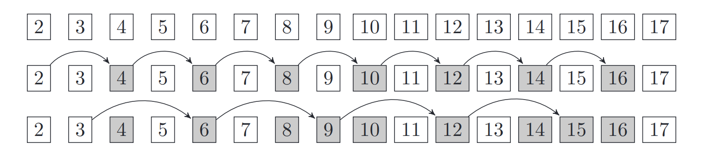
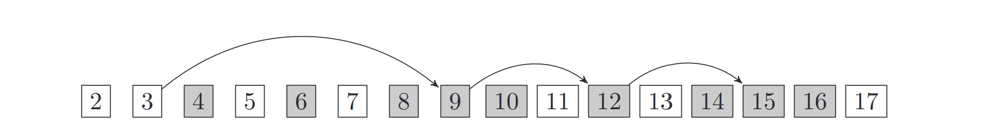

# Sieve of Eratosthenes

The Sieve of Eratosthenes is a very simple and popular technique for finding all the prime
numbers in the range from 2 to a given number n. The algorithm takes its name from the
process of sieving—in a simple way we remove multiples of consecutive numbers.

Initially, we have the set of all the numbers {2, 3, . . . , n}. At each step we choose the
smallest number in the set and remove all its multiples. Notice that every composite number
has a divisor of at most √n. In particular, it has a divisor which is a prime number. It
is sufficient to remove only multiples of prime numbers not exceeding √n. In this way, all
composite numbers will be removed.

The above illustration shows steps of sieving for n = 17. The elements of the processed set
are in white, and removed composite numbers are in gray. First, we remove multiples of the
smallest element in the set, which is 2. The next element remaining in the set is 3, and we
also remove its multiples, and so on.

The above algorithm can be slightly improved. Notice that we needn’t cross out multiples
of i which are less than i
2. Such multiples are of the form k · i, where k < i. These have
already been removed by one of the prime divisors of k.