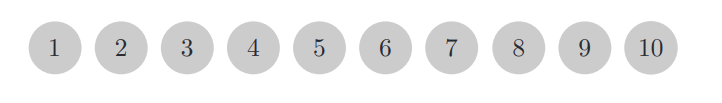
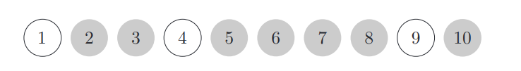

# Reversing Coins - Codility

Consider n coins aligned in a row. Each coin is showing heads at the beginning.

Then, n people turn over corresponding coins as follows. Person i reverses coins with numbers
that are multiples of i. That is, person i flips coins i, 2 · i, 3 · i, . . . until no more appropriate
coins remain. The goal is to count the number of coins showing tails. In the above example,
the final configuration is:

